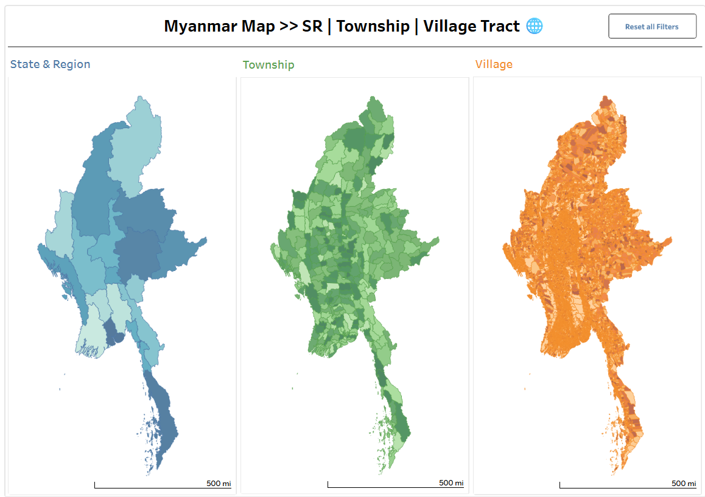

# 🗺️ Myanmar Administrative Map (Tableau)

## Overview
This project presents an interactive Tableau Vizz that visualizes Myanmar’s administrative hierarchy, enabling users to explore data from State & Region level down to Township and Village Tract.

## Objectives
- Provide a clear geographic representation of administrative boundaries
- Enable drill-down analysis across multiple levels
- Improve accessibility of spatial data insights

## Tools & Technologies
- Tableau (Dashboard & Mapping)
- GIS Data Processing
- Data Visualization Techniques

## Features
- Interactive map visualization of Myanmar
- Filter by State & Region
- Drill-down functionality:
- State & Region → Township → Village Tract
- User-friendly dashboard design

## 📽 Demo
Watch here: https://www.linkedin.com/posts/y%C3%A8-htet-hein_dataanalytics-tableau-gis-activity-7439749087119376384-I0Xy?utm_source=share&utm_medium=member_desktop&rcm=ACoAACzAL6UBnAV1tYBGXRsydz_osj5ddOVcoeI
Full project available on Tableau Public: https://public.tableau.com/views/MyanmarMapSRTownshipVillageTract/MyanmarMapSRTownshipVillageTract?:language=en-US&:sid=&:redirect=auth&:display_count=n&:origin=viz_share_link

## Dashboard Preview

## Project File
- `Myanmar Map - SR - Township - Village Tract.twbx` – Tableau Packaged Workbook

## How to Use
1. Download the `.twbx` file
2. Open using Tableau Desktop
3. Interact with filters and map layers

## Key Insights
- Administrative structures can be explored efficiently through hierarchical mapping
- Interactive dashboards improve understanding of geographic distributions
- Useful for planning, monitoring, and decision-making in development projects

## Future Improvements
- Add population or socio-economic data layers
- Integrate real-time datasets
- Enhance UI/UX for better interactivity

## Author
Ye Htet Hein  
Data Analyst | Business Intelligence Enthusiast
